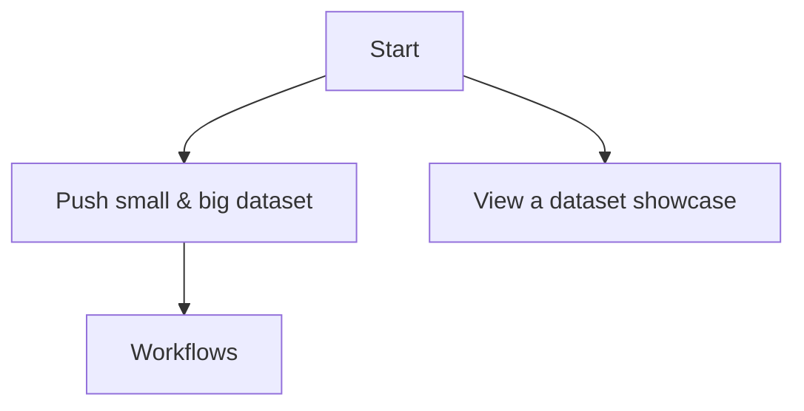

An experiment with a fully-git(hub) based DataHub. We hope this can become https://next.datahub.io/

To start with let's KISS: fully GitHub based so GitHub provides MetaStore + HubStore

Here's a walk through of the desired experience. We walk through 3 cases:

* "Small" data files -- these are stored in git.
* "Big" data files (> a few Mb) -- these are stored via git-lfs + giftless into your cloud of choice
* "Dependencies" -- I want to use external data in my project that I don't manage or want to store directly **not specced yet**

# Small Data Example

## The Dataset

Suppose you have a dataset on your hard disk like:

```
my-dataset/
  datapackage.json
  mydata.csv
  README.md
```

`datapackage.json` contents:

```json=
{
  "name": "my-dataset",
  "title" "My awesome dataset",
  "resources": [
    {
      "name": "mydata",
      "path": "mydata.csv"
    }
  ]
}
```

`mydata.csv`

```
A,B,C
1,2,3
```

`README.md`

```console=
$ echo "This is my awesome dataset. Check it out now!" > README.md
```

## Pushing a Dataset

```console=
$ cd my-dataset
$ git init
$ git add *
$ git commit "My new dataset"
$ git push https://github.com/myorg/my-dataset
```

If we added lfs setup we need an lfsinfo:

```
echo "..." > .lfsinfo
```

## Then on DataHub.io

Showcase page:

`$ open https://datahub.io/@myorg/my-dataset/`


# Big(ger) data ... (too big on git)

Let's modify our previous example to have a large file:

```
my-dataset/
  datapackage.json
  mybigdata.csv
  README.md
```

`datapackage.json` contents:

```json=
{
  "name": "my-dataset",
  "title" "My awesome dataset",
  "resources": [
    {
      "name": "mybigdata",
      "path": "mybigdata.csv"
    }
  ]
}
```

## Add support for storing large data in the cloud

Set a custom LFS server that will then hand out credentials for you to store the file in the cloud

```
# see https://github.com/git-lfs/git-lfs/wiki/Tutorial#lfs-url
# this uses the default datahub.io provided cloud storage
$ git config -f .lfsconfig lfs.url https://giftless.datahub.io/
$ git add .lfsconfig
$ git commit -m "Setting up custom storage for my big data files on datahub.io storage"
```

:::info
It would be really cool to allow people to bring their own storage if they wanted e.g. `lfs.url` is

```
https://giftless.datahub.io/s3/mybucket/
```
:::

## Pushing a Dataset

```console=
$ git lfs track mybigdata.csv
$ git add *
$ git commit "My new dataset"
$ git push https://github.com/myorg/my-dataset
```

---

# How does this work in the background (mixed case of some data in git, some cloud (via git-lfs))

Say we have this as our structure:

```
# datapackage.json
{
  name: 'my-dataset',
  resources: [
    {
      "name": "mydata",
      "path": "mydata.csv"      # stored in the git repo using git protocol ...
    },
    {
      "name": "mybigdata",
      "path": "mybigdata.csv"   # pointer stored in the git repo using git-lfs protocol .
                                # actual file in cloud storage    ..
    },
    {
      "name": "myremotedata",
      "path": "https://mysite.com/thedata.csv"  # stored online somewhere
    }
  ]
}

# mydata.csv
A,B,C
1,2,3

# mybigdata.csv - stored in cloud storage
version https://git-lfs.github.com/spec/v1
oid sha256:4d7a214614ab2935c943f9e0ff69d22eadbb8f32b1258daaa5e2ca24d17e2393
size 12345
```

Then how would this show up ...

# What is the plan?

Outcome visioning: I can do either the paths above and view my dataset on next.datahub.io




* [ ] Push
  * [x] Push "small" data **working today pretty much 😉 - the only thing beyond basic git is adding datapackage.json which you literally do "by hand" for now**
  * [ ] Push flow works with big files to the cloud
    * [ ] Deploy a giftless server https://github.com/datopian/giftless
      * [ ] Have a cloud storage provider and e.g. a bucket
      * [ ] Have giftless backend for this
    * [ ] Push my dataset (as per above)
    * [ ] Verify it worked (someone else can clone!)
      * [ ] What about auth? **Let's make giftless hand out tokens all the time atm ...**
* [ ] Showcase: showcase a dataset i.e. i can visit datahub.io/github.com/datasets/my-small-test-dataset/ and ditto for big dataset and it looks something like datahub.io/core/finance-vix today ...
  * [ ] Choose a JS based frontend framework
  * [ ] Mock out the page
  * [ ] Wire it up
    * [ ] Write a backend client (and abstraction) library e.g. `getDatasetMetadata(identifier, ref='master'), getFileUrl(dataset, ...)`
  * [ ] Deploy
* [ ] Workflows: build workflows that are triggered on each change or other times e.g. "Derived data / alternate formats" (build me zip, build me json for this csv), data validation, ...
  * [ ] Abuse github workflows for now ...
    * [ ] Have a pattern and core library for this ..
  * [ ] Plan out how to move to cloud based airflow or Beam or similar ...
  * [ ] Monitoring and reporting (e.g. minutes used, what's failing etc)
    * [ ] Integrate into a user dashboard on datahub.io
